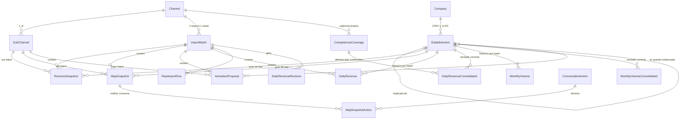

# Arquitetura da aplicação de relatórios BIN

> **Nota (2026-08-30):** os identificadores de schema e código citados neste plano
> (`competencia_coverages`, `max_dia_conhecido`, `sub_canal`, `razao_social`, `dia_corte_mes_atual`…)
> foram renomeados para inglês depois da escrita (`period_coverages`, `max_known_day`, `name`,
> `legal_name`, `current_month_cutoff_day`…). O plano fica como registro histórico; a convenção
> vigente está em `CLAUDE.md`.

Fonte única deste plano: o arquivo [1478_MASTER_FRANQUEADO_RAMOS_E_SILVA_20260825.xlsx](./1478_MASTER_FRANQUEADO_RAMOS_E_SILVA_20260825.xlsx). Nada abaixo vem de outro sistema (search-company, Hermes, Receita Federal). Toda contagem citada foi medida no arquivo.

## Eixo do modelo

```text
CANAL  ->  SUB-CANAL  ->  CLIENTE (CNPJ)  ->  EC (grão técnico)
                                                 |
                                                 +-- faturamento diário
                                                 +-- volumes mensais
```

O **cliente é o CNPJ**, não o EC. O **EC é o grão onde o fato mora**, porque a planilha traz faturamento por EC, mas não é a unidade de relatório. Toda agregação e a auditoria acontecem por CNPJ dentro do SUB-CANAL, com o EC disponível como detalhamento.

## Decisões fechadas

**Cadência: 1 a 2 arquivos por semana, por canal.** Cada arquivo é um corte do mês em andamento de **um** master franqueado. O arquivo em análise cobre os dias 1 a 24 de agosto do canal `MASTER FRANQUEADO RAMOS E SILVA`; o próximo traz 1 a 27 ou 1 a 31, preenchendo as lacunas. Isso define a arquitetura de persistência mais do que qualquer outra decisão.

**Multi-canal.** Vários master franqueados enviam seus próprios arquivos, cada um com sua cadência e seu dia de corte. Consequência direta: o canal entra na chave de tudo que controla cobertura temporal, e nenhuma comparação entre canais pode assumir o mesmo dia de corte (ver a regra de alinhamento na seção de auditoria).

**Versões: Ruby 4.0.6 e Rails 8.1.3.1.** Pinadas. Ruby 4.0.6 saiu em 14/07/2026; Rails 8.1.3.1 saiu em 29/07/2026 (correção de segurança do Active Storage, CVE-2026-66066). `.ruby-version` e `Gemfile` (`gem 'rails', '8.1.3.1'`) carregam exatamente essas versões. Sem `~>` no Rails: patch de segurança se troca com commit explícito, não no `bundle update` do dia.

**Armazenamento: PostgreSQL.** Dado tabelar com chaves, fatos numéricos e séries no tempo. Joins, constraints e agregação são o caso de uso. O volume não justifica warehouse nem NoSQL.

**Fila: Solid Queue no mesmo PostgreSQL.** Rails 8.1 já traz isso. O job de import é ActiveJob; não entra Redis. Menos um serviço no compose e a mesma transação do upsert consolidado.

**Aplicação: Rails 8.1.3.1 nova neste diretório.** Import de XLSX, CRUD manual e telas de relatório são ActiveRecord + ActiveJob + ActiveStorage. Rails não é o framework mais rápido em benchmark, e isso não decide aqui. Onde a performance realmente aparece: `insert_all` em lote no job, upsert na camada consolidada, agregação em *materialized view* no banco e leitura do XLSX em streaming com `roo`.

**Docker Compose para o banco e os usos principais.** A aplicação e o Metabase sobem pelo compose; o banco é a imagem `pgvector/pgvector` (PostgreSQL 16), porque a primeira migration liga `vector` e a imagem vanilla do Postgres não traz essa extensão. Serviços:

| Serviço | Imagem / build | Uso |
|---|---|---|
| `db` | `pgvector/pgvector:pg16` | PostgreSQL com `plpgsql`, `pgcrypto`, `pg_trgm`, `unaccent` (nativos) e `vector` (da imagem) |
| `web` | build local, Ruby 4.0.6 | Puma, telas e upload do XLSX |
| `worker` | mesmo build, `bin/jobs` | Solid Queue: import, upsert consolidado, refresh das views |
| `metabase` | `metabase/metabase` | Análise ad-hoc sobre a role somente leitura |

Volume nomeado no `db`. Healthcheck do Postgres antes de `web`/`worker`/`metabase`. A role `metabase_ro` é criada na migration de roles, não no `init.sql` do container — o schema precisa existir primeiro.

O que **não** entra no compose: Redis, Elasticsearch, mailcatcher. Não há uso no plano.

**Layout: Hotwire + Tailwind CSS 4 + daisyUI 5.** É a soma pedida: Tailwind como motor de CSS (A) e componentes prontos no lugar do Bootstrap (C), sem carregar os dois frameworks. `rails new` com `--css tailwind`. Gem `tailwindcss-rails` (Tailwind 4). daisyUI 5 entra como `@plugin` no `app/assets/tailwind/application.css`. Instalação pelo módulo ESM documentado pela daisyUI para Rails, **sem Node** — o compose do `web` não ganha `node_modules`. CDN da daisyUI não entra: quebra offline e o purge.

Hotwire: Turbo para filtro/paginação em `<turbo-frame>` e Stimulus para o pouco de JS (ordenar coluna, confirmar upload). Sem SPA, sem React, sem Bootstrap.

Componentes daisyUI que esta app usa de fato: `table`, `btn`, `input`, `select`, `alert`, `badge`, `card`, `modal`, `menu`, `navbar`, `loading`. Tema `light` como default — relatório se imprime e se exporta; dark fica desligado até alguém pedir. Utilitário Tailwind entra só no que a daisyUI não cobre (alinhamento do dia de corte no cabeçalho, largura de coluna numérica).

O que **não** entra no layout: Bootstrap, ViewComponent nesta fatia (dá para extrair depois se o mesmo `table` + `badge` de variação se repetir em 4 telas), CSS próprio em BEM.

**Análise ad-hoc: Metabase** sobre o mesmo PostgreSQL, com role somente leitura restrita às views.

**Importação: snapshot imutável + camada consolidada.** Cada arquivo válido vira um `import_batch` novo; nada é sobrescrito, nem com o mesmo `REPORT_ID` `1478`. Por cima, uma camada de verdade corrente responde "qual o melhor valor conhecido para este EC neste dia", alimentada por upsert do batch mais recente. Sem essa camada, importar semanalmente produziria oito versões concorrentes do mesmo mês sem definir qual vale.

### Volume esperado

Neste arquivo, que representa um canal: 457 `revenue_snapshots`, 552 `map_snapshots`, 94 `activation_proposals`, 6.807 `daily_revenues` (só valores diferentes de zero), 7.000 `monthly_volumes`, 617 `map_snapshot_actions`, 1.103 `raw_import_rows` — cerca de **16,6 mil linhas por arquivo**.

O volume escala com o número de canais, não com o tempo apenas. Para um canal deste tamanho, a 6 ou 7 arquivos por mês: cerca de 110 mil linhas/mês e 1,3 milhão/ano. Com dez canais de porte semelhante: cerca de 1,1 milhão/mês e 13 milhões/ano.

Por isso duas decisões que seriam otimização posterior num cenário de canal único entram no desenho inicial: **particionar `daily_revenues` por competência** e **liderar os índices por `channel_id`**. As tabelas consolidadas, que são as lidas pelos relatórios, permanecem pequenas — cerca de 51 mil linhas/ano por canal em `daily_revenues_consolidated` e 28 mil/ano em `monthly_volumes_consolidated` — e é sobre elas que os relatórios rodam.

### Identificadores: três camadas

**1. `id` bigint — chave interna.** Chave primária e alvo de todas as FKs. Nunca aparece em URL, tela ou exportação. É bigint e não UUID de propósito: as tabelas de fato chegam a 13 milhões de linhas por ano no cenário multi-canal, e chave de 8 bytes com inserção sequencial mantém o índice compacto, enquanto UUID aleatório de 16 bytes fragmentaria o B-tree e dobraria o tamanho de cada chave estrangeira.

**2. `uuid` — nosso identificador público.** `uuid` v4 com `default gen_random_uuid()` e índice único. É o que aparece em URL, exportação e integração, via `to_param`. Fica apenas nas entidades endereçáveis de fora: `channels`, `sub_channels`, `companies`, `establishments`, `import_batches`. As tabelas de fato (`daily_revenues`, `monthly_volumes`, `raw_import_rows`) não recebem `uuid`, porque nunca são referenciadas individualmente de fora — colocar lá seria pagar 16 bytes por linha em milhões de registros sem uso.

**3. Referências externas — de terceiros.** `EC` e `REPORT_ID` são da Fiserv, guardados em `establishments.ec` e `channels.external_id`; `CNPJ` é da Receita Federal, em `companies.cnpj`. Continuam com índice único, porque são o que casa o import com o registro existente, mas deixam de ser a identidade do registro.

A separação não é preciosismo. O achado 11 mostra que a Fiserv emite mais de um `EC` para o mesmo estabelecimento, ao mesmo tempo. Ancorar nossa identidade em numeração de terceiro, que duplica e pode mudar de regra sem aviso, seria identidade emprestada.

## O que o arquivo prova

| Aba | Linhas | Colunas | Chave única na aba | CNPJs distintos |
|---|---|---|---|---|
| `Faturamento` | 457 | 82 | `EC` | 297 |
| `Ativacao` | 94 | 15 | `NR DA PROPOSTA` e `EC` | 60 |
| `Mapa de Clientes BIN` | 552 | 79 | `EC` | 359 |

No arquivo inteiro: **582 `EC` distintos** e **373 `CNPJ` distintos**, distribuídos em 10 sub-canais.

O mesmo `EC` aparece em mais de uma aba, com dados diferentes: 125 `EC` em uma aba só, 393 em duas, 64 nas três. É por isso que cada aba tem sua própria tabela de snapshot.

## Achados que sustentam o desenho (medidos, não supostos)

### 1. `EC` tem pouco peso; o cliente é o `CNPJ`

- 194 dos 373 CNPJs têm mais de um `EC` (181 com dois, 11 com três, 2 com quatro)
- Dos 156 CNPJs com mais de um `EC` no Faturamento, apenas **5 faturam em mais de um `EC`**; 114 concentram tudo em um só e 37 não faturam em nenhum
- 169 CNPJs têm `EC` com `SEGMENTO PERFORMADO` divergente entre si e 22 têm `STATUS DO CONTRATO` divergente. O padrão típico é um `EC` `Suspended`/`PJ1` e outro `Active`/`Inativo` no mesmo CNPJ
- 21 CNPJs têm `EC` que diferem apenas no primeiro dígito (ex.: `32546997` e `92546997`), o que reforça numeração técnica e não identidade de negócio
- **O grão muda o número reportado:** no mês atual, 208 de 457 `EC` faturaram (46%), mas 203 de 297 CNPJs faturaram (68%). Reportar inatividade por `EC` infla o problema em 22 pontos

### 2. `HIERARQUIA` não pode fazer parte da identidade do canal

Cinco dos dez sub-canais aparecem sob dois valores diferentes de `HIERARQUIA`: `Faturamento` e `Mapa` usam `MASTER FRANQUEADO RAMOS E SILVA`, enquanto `Ativacao` usa `FRANQUIAS`. O `CANAL` é o mesmo nas três abas. Ou seja, `HIERARQUIA` é rótulo da aba de origem, não nível hierárquico real. A identidade do canal é o `CANAL`; `HIERARQUIA` fica gravada na linha de snapshot como metadado da origem. Uma linha do Mapa vem com `CANAL` vazio.

### 3. Cliente pertence a um sub-canal, com exceção

372 dos 373 CNPJs aparecem em um único `SUB-CANAL`. A exceção é `45573486000195`, presente em `MIC GOIANIA 4` e `MIC RAMOS E SILVA GOIANIA`. Nenhum `EC` aparece em mais de um sub-canal. Portanto o vínculo com sub-canal fica na linha de snapshot (por batch), não fixo no cadastro do cliente — isso também permite acompanhar realocação de carteira entre importações.

Essa exceção **não deveria ocorrer com frequência** (1 em 373 neste arquivo). O import apenas a registra em `data_anomalies` (`company_in_multiple_sub_channels`), sem corrigir nada. A tela em que o operador visualiza a discrepância — os dois sub-canais lado a lado, faturamento de cada um, e decide se é carteira compartilhada ou erro de origem — fica **para depois**. Não entra na primeira entrega de relatórios. O registro agora existe para o caso não se perder e para a fila não nascer vazia quando a tela chegar.

### 4. Cada arquivo é um corte parcial do mês em andamento

- `fat_total_m1` + `DIA 01_M_1`…`DIA 31_M_1` = **mês anterior**, fechado (movimento até o dia 31)
- `FATURAMENTO TOTAL DESTE MÊS` + `DIA 01`…`DIA 31` = **mês em andamento**, com movimento até o dia 24 neste arquivo
- O corte é nítido: o dia 24 tem 140 ECs vendendo e R$ 193.780,04; os dias 25 a 31 são exatamente zero em todos os 457 ECs. O dia 23 cai para 87 ECs mas não zera, então derivar o corte pelo último dia com movimento é confiável numa carteira desse tamanho
- A competência sai por reconciliação com o Mapa: `fat_total_m1` bate com `VOLUME DE FATURAMENTO TOTAL 202607` em 278/278 comparáveis e `FATURAMENTO TOTAL DESTE MÊS` bate com `202608` em 278/278. Logo `M_1` = `2026-07` e mês em andamento = `2026-08`
- A soma dos 31 dias é exatamente igual ao total declarado em 457/457, nas duas séries

Os dias 25 a 31 não estão faltando por defeito do arquivo: serão preenchidos pelo próximo import da semana. E quando o arquivo de setembro chegar, agosto voltará na série `M_1` já fechada — o mesmo dia chega primeiro provisório e depois definitivo. A camada consolidada existe para resolver isso.

**Consequência crítica para qualquer comparação:** somar o total do mês em andamento contra o total do mês fechado é comparar 24 dias contra 31 e produz queda falsa. Medido nos dois modos:

| Sub-canal | M-1 dias 1–24 | Atual dias 1–24 | Variação correta | Variação ingênua |
|---|---|---|---|---|
| MIC FRANCISCO AURELIO PARAIBA PB | 1.988.904,27 | 1.857.970,12 | -6,6% | -27,9% |
| MIC GOIANIA 4 | 1.747.559,59 | 1.980.983,59 | **+13,4%** | -12,6% |
| MIC RAMOS E SILVA GOIANIA | 862.212,05 | 884.036,33 | **+2,5%** | -22,7% |
| MIC HERBERT GOMES CAMPINA GRANDE PB | 588.638,12 | 534.030,78 | -9,3% | -30,6% |
| MIC CAMPINA GRANDE | 381.930,98 | 239.471,20 | -37,3% | -45,7% |
| MIC APARECIDA DE GOIANIA GO 1 | 126.668,29 | 75.793,58 | -40,2% | -47,4% |
| MIC RAMOS E SILVA NATAL | 8.000,00 | 3.310,00 | -58,6% | -81,6% |
| MIC RAMOS E SILVA JOAO PESSOA | 5.884,70 | 4.510,00 | -23,4% | -42,5% |
| **TOTAL** | **5.709.803,00** | **5.580.201,30** | **-2,3%** | **-24,3%** |

Dois sub-canais invertem o sinal e a carteira passa de "caiu 24%" para "caiu 2%". Alinhar o período é requisito da aplicação, não refinamento.

### 5. A série diária é 76% zero

As 62 colunas de dia estão materializadas em 100% das células, com zero explícito, mas só **24% dos valores são diferentes de zero** (6.807 de 28.334). Gravar apenas o não-zero reduz `daily_revenues` em 76%, o que importa muito a 6 ou 7 arquivos por mês.

Isso exige uma convenção explícita: **ausência de linha significa zero até o dia de corte, e desconhecido depois dele**. Sem guardar o dia de corte, "não vendeu" e "o dia ainda não aconteceu" ficariam indistinguíveis — foi exatamente o que produziu a coluna de variação ingênua acima.

### 6. Cada arquivo carrega cinco competências mensais

As colunas de volume do Mapa cobrem `202604` a `202608` nas quatro famílias (`TOTAL`, `CRÉDITO`, `DÉBITO`, `ANTECIPAÇÃO`), sempre com 350 de 552 ECs preenchidos. Com import semanal, as competências fechadas (`202604` a `202607`) se repetem em todos os arquivos e devem permanecer idênticas; se mudarem, é revisão de dado e precisa ser registrada, não sobrescrita em silêncio. A competência aberta (`202608`) cresce a cada arquivo.

### 7. `MELHOR CONVERSA` é lista de ações, não texto livre

Preenchido em 412 de 552 linhas, com apenas **12 combinações distintas** formadas por **8 ações**, separadas por `>`:

| Ocorrências | Ação |
|---|---|
| 201 | Verificar se tem outras máquinas ou CNPJs |
| 171 | Verificar reciprocidade e condições comerciais |
| 98 | Baixa rentabilidade: Verificar se é necessário reajustar MDR |
| 48 | Entender porque diminuiu/parou de faturar: Volume de vendas? Concorrência? Taxas? |
| 33 | Triagem de boarding |
| 33 | Tirar dúvidas e incentivar a digitalização |
| 24 | Incentivar antecipação automática ou flex |
| 9 | Verificar Status da instalação |

São as ações sobre faturamento que o cliente não atingiu. Viram tabela de domínio + relação, não string. É o "por quê" que acompanha cada número da auditoria.

### 8. Divergências entre abas para o mesmo `EC`

- `RAZÃO SOCIAL` e `NOME FANTASIA` estão **invertidas** entre `Mapa` e as outras abas em 457 de 457 casos comparáveis
- `CEP`: `75980-000` no Faturamento, `75980000` no Mapa
- `TELEFONE DO TRABALHO`: `64999980907` no Faturamento, `064999980907` no Mapa
- Datas: serial Excel em Faturamento e Ativacao; texto `dd/mm/yyyy` no Mapa; ISO com hora em `vip_boarding_date` e `ULTIMO ACESSO NO APP`
- Concordam 100%: `CNPJ`, `STATUS DO CONTRATO`, `CNAE`, `SUB-CANAL`, `ENDEREÇO`/`CIDADE`/`ESTADO` (454/454, 3 vazios em ambos)

### 9. Outros pontos de tratamento

- `NET MDR` é numérico em 205 linhas e traz a sentinela textual `Inativo` em 347. Cast direto quebra
- Proposta só vira `EC` da carteira quando embarca: os 30 `EC` exclusivos de Ativacao são todos `Credit Declined` (20) ou `Pending QC` (10); os 64 embarcados estão todos no Mapa
- `PARCELA_PRE_APROVADA` vazia em 552/552; `agenda_semanal` = `Em breve` em 552/552; `STATUS ANTECIP AUTO NO BOARDING` e `...BOARDING.1` têm valores idênticos e não devem ser fundidas
- `CNPJ` tem zero à esquerda (53 no Faturamento, 62 no Mapa, 1 em Ativacao) e sempre 14 caracteres: texto, nunca inteiro
- 224 dos 457 `EC` do Faturamento não tiveram venda em nenhum dos dois meses

### 10. Como o arquivo identifica o canal

Cada arquivo contém exatamente **um** canal, o que sustenta o cenário multi-canal sem ambiguidade:

- `CANAL` tem um único valor nas três abas: `MASTER FRANQUEADO RAMOS E SILVA` (457/457 no Faturamento, 94/94 em Ativacao, 551/552 no Mapa, com uma linha vazia)
- `REPORT_ID` existe **apenas na aba Mapa** e vale `1478` em 552/552 linhas
- O `REPORT_ID` do conteúdo é exatamente o prefixo do nome do arquivo: `1478_MASTER_FRANQUEADO_RAMOS_E_SILVA_20260825.xlsx`

Logo `REPORT_ID` é o identificador estável do canal e `CANAL` é o nome de exibição. O nome do arquivo replica os dois mais a data de extração (`20260825`), coerente com o corte no dia 24 — extração no dia 25 cobrindo até o dia 24. A data do nome entra como conferência, não como fonte: o corte continua sendo derivado do movimento.

`HIERARQUIA` reforça o achado 2: vale o nome do canal no Faturamento e no Mapa, mas `FRANQUIAS` em Ativacao, no mesmo arquivo e para o mesmo canal.

### 11. A Fiserv emite `EC` duplicado para o mesmo estabelecimento

O `EC` tem sempre 8 dígitos. O primeiro dígito se distribui assim nos 582 ECs do arquivo: `9` em 558, `3` em 21, `2` em 2 e `4` em 1.

- **Os 21 ECs com prefixo `3` têm, todos, um par `9` + mesmo sufixo sob o mesmo CNPJ** (21 de 21). Exemplo: `32546997` e `92546997` no CNPJ `55092685000135`
- Os pares compartilham data de credenciamento, CNAE, endereço, razão social e status. **Não é renumeração ao longo do tempo: é registro paralelo simultâneo**
- Só um lado performa: dos 21 ECs prefixo `3`, 20 estão `Inativo` e apenas 1 teve faturamento (R$ 325,00). Entre os prefixo `9`, 53% faturaram, somando R$ 11.289.679,30
- Os 2 ECs prefixo `2` e o 1 prefixo `4` também estão `Inativo` e sem faturamento; não verifiquei se têm par
- Entre os 184 CNPJs com mais de um EC no Mapa: 100% têm o mesmo CNAE, 98% a mesma razão social e 92% o mesmo endereço
- Nos 22 CNPJs com um EC `Active` e outro `Suspended`, 19 têm a mesma data de credenciamento e apenas 3 têm o `Active` credenciado depois — ou seja, mesmo essa divergência é majoritariamente registro simultâneo, não migração de contrato

Consequência para os relatórios: contar estabelecimentos pelo `EC` infla a base. Mas somar faturamento por `EC` não perde nada, e o duplicado que faturou R$ 325,00 prova que descartá-lo seria errado. Daí a regra da seção de auditoria: **contar sobre os principais, somar sobre todos**.

O padrão prefixo `3` com par `9` é forte o suficiente para virar sugestão automática de duplicata, e fraco o suficiente para não virar fusão automática: 21 casos num arquivo não autorizam a generalizar a regra de numeração da Fiserv.

## Modelo de dados



### Decisão de nomenclatura (escolha, não fato do arquivo)

`Faturamento` e `Ativacao` concordam entre si; `Mapa` está invertido. Adoto a convenção de `Faturamento`/`Ativacao` como canônica por maioria. O template mapeia `Mapa.RAZÃO SOCIAL → nome_fantasia` e `Mapa.NOME FANTASIA → razao_social`. O valor bruto, sem troca, continua em `raw_import_rows`. Se a Fiserv confirmar que o Mapa está certo, troca-se o mapeamento do template sem perder dado.

## Primeira migration: extensões do PostgreSQL

Antes de qualquer tabela. Sem elas, `gen_random_uuid()`, busca por similaridade e `unaccent` quebram na migration seguinte.

```ruby
enable_extension 'plpgsql'
enable_extension 'pgcrypto'
enable_extension 'pg_trgm'
enable_extension 'unaccent'
enable_extension 'vector'
```

| Extensão | Por que entra agora |
|---|---|
| `plpgsql` | Já vem ligada no PostgreSQL; fica explícita para o schema não depender do default do host |
| `pgcrypto` | `gen_random_uuid()` no `uuid` das cinco entidades públicas. Sem ela, a segunda migration não sobe |
| `pg_trgm` | Índice GIN em `canal`, `sub_canal`, `razao_social`, `nome_fantasia`, `cidade`. Busca do operador por "goiania" encontra `MIC GOIANIA 4` sem `LIKE '%...%'` sequencial |
| `unaccent` | `GOIÂNIA` e `GOIANIA` são o mesmo termo na busca. Sem isso, `pg_trgm` sozinho não resolve acento |
| `vector` | `pgvector`. Nenhuma tabela a usa na primeira entrega. Entra agora porque a imagem do compose já é `pgvector/pgvector:pg16`; instalar depois no host vanilla exige pacote e, em alguns ambientes, restart. Uso futuro possível: busca semântica em `MELHOR CONVERSA` e em notas do operador — sem inventar feature hoje |

O que **não** entra, e por quê:

- `uuid-ossp` — redundante com `pgcrypto.gen_random_uuid()`
- `citext` — `CNPJ` e `EC` já têm formato fixo; case-insensitive pode esperar e-mail
- `pg_stat_statements` — monitoramento de host, não de schema da aplicação

## Tabelas e campos

Convenção: origem no formato `Aba.COLUNA`. Campo sem origem é gerado pela aplicação.

### `channels` — o canal (master franqueado)

| Campo | Tipo | Origem |
|---|---|---|
| `id` | bigint PK | — |
| `uuid` | uuid, unique, `gen_random_uuid()` | nosso |
| `external_id` | string, unique | `Mapa.REPORT_ID` (`1478`) — identificador do canal na Fiserv, igual ao prefixo do nome do arquivo |
| `canal` | string | `CANAL` (as 3 abas). Nome de exibição: `MASTER FRANQUEADO RAMOS E SILVA` |

`external_id` é a referência externa que casa o arquivo com o canal; `uuid` é o que a aplicação expõe.

**Sobre o nome da coluna:** `REPORT_ID` é rótulo técnico da Fiserv e não diz nada no nosso domínio, então virou `external_id`, coerente com a camada 3 do modelo de identidade. Já `ec` e `cnpj` ficam com o nome original de propósito: são vocabulário que o operador fala em voz alta, e renomeá-los para `external_id` tornaria o código mais distante da planilha e da conversa. A regra que adoto: referência externa com nome técnico opaco vira `external_id`; referência externa que é termo de negócio mantém o termo.

### `sub_channels` — o micro franqueado

| Campo | Tipo | Origem |
|---|---|---|
| `id` | bigint PK | — |
| `uuid` | uuid, unique, `gen_random_uuid()` | nosso |
| `channel_id` | FK → `channels.id` | — |
| `sub_canal` | string | `SUB-CANAL` (as 3 abas) |

Unicidade em (`channel_id`, `sub_canal`). Neste arquivo: 10 sub-canais, de `MIC GOIANIA 4` (217 EC no Mapa) a `MIC CEARA` (1 EC).

### `companies` — o cliente

| Campo | Tipo | Origem |
|---|---|---|
| `id` | bigint PK | — |
| `uuid` | uuid, unique, `gen_random_uuid()` | nosso |
| `cnpj` | string(14), unique | `CNPJ` (as 3 abas; texto, preserva zero à esquerda) |

O `CNPJ` continua com índice único porque é o que casa o import, mas o cliente é referenciado pelo `uuid` em tela, URL e exportação — o CNPJ não precisa circular para identificar um registro.

373 clientes neste arquivo. O sub-canal do cliente **não** fica aqui: fica na linha de snapshot, porque um CNPJ já aparece em dois sub-canais e porque a carteira pode ser realocada entre batches.

### `establishments` — o EC (grão técnico)

| Campo | Tipo | Origem |
|---|---|---|
| `id` | bigint PK | — |
| `uuid` | uuid, unique, `gen_random_uuid()` | nosso |
| `ec` | string(8), unique | `EC` (as 3 abas) — referência externa Fiserv |
| `company_id` | FK → `companies.id` | `CNPJ` da mesma linha (consistente em 457/457 nas abas comparáveis; divergência vira erro de import) |
| `channel_id` | FK → `channels.id` | denormalizado para escopo e particionamento; EC mudando de canal entre batches vira alerta, não atualização silenciosa |
| `primary_establishment_id` | FK → `establishments.id`, nullable | auto-referência: preenchido quando este EC é duplicata de outro (ver achado 11). `NULL` = é o principal |
| `duplicate_reason` | string, nullable | ex.: `fiserv_parallel_registration` |
| `duplicate_confirmed_by` | string, nullable | quem confirmou a duplicata |
| `duplicate_confirmed_at` | timestamptz, nullable | quando |

582 ECs neste arquivo. Existe para ancorar fato, não para ser unidade de relatório.

**A duplicata nunca é automática.** O import detecta o candidato (EC prefixo `3` cujo par `9` + mesmo sufixo existe no mesmo CNPJ: 21 casos aqui) e o deixa numa fila de revisão. `primary_establishment_id` só é gravado por decisão humana registrada. Enquanto não confirmado, os dois ECs seguem como principais e a contagem fica inflada — de propósito, para que o problema apareça em vez de ser resolvido por adivinhação.

Restrição a garantir: `primary_establishment_id` só pode apontar para um EC do mesmo `company_id`, e um EC marcado como duplicata não pode ser principal de outro (sem cadeia).

### `import_batches` — um por arquivo

| Campo | Tipo | Origem |
|---|---|---|
| `id` | bigint PK | — |
| `uuid` | uuid, unique, `gen_random_uuid()` | nosso |
| `channel_id` | FK → `channels.id` | derivado do `REPORT_ID`/`CANAL` do arquivo; **um arquivo, um canal** (ver achado 10) |
| `import_template_id` | FK | template detectado |
| `source_filename` | string | nome do arquivo |
| `source_file_date` | date, nullable | data extraída do nome (`20260825`); serve de conferência contra `dia_corte_mes_atual`, não de fonte |
| `file_checksum` | string, unique | sha256; **bloqueia reenvio do mesmo arquivo**, cenário provável em rotina semanal |
| `competencia_m1` | date | derivado por reconciliação (`2026-07` aqui) |
| `competencia_atual` | date | idem (`2026-08` aqui) |
| `competencias_cobertas` | jsonb | todas as competências do arquivo (`202604`–`202608` aqui) |
| `dia_corte_mes_atual` | smallint | último dia com movimento na série do mês em andamento (24 aqui). Define até onde o batch conhece o mês; editável com registro de quem alterou |
| `status` | enum (`pending`,`validated`,`failed`,`superseded`) | resultado das validações |
| `validation_errors` | jsonb | detalhe das falhas |
| `created_at` | timestamptz | ordem de precedência na consolidação |

### `import_templates` / `import_template_columns`

| Campo | Tipo | Origem |
|---|---|---|
| `import_templates.id` | bigint PK | — |
| `import_templates.name` | string | ex.: "Template BIN v1" |
| `import_templates.sheet_names` | jsonb | `["Faturamento","Ativacao","Mapa de Clientes BIN"]` |
| `import_template_columns.import_template_id` | FK | — |
| `import_template_columns.sheet_name` | string | `Faturamento` / `Ativacao` / `Mapa de Clientes BIN` |
| `import_template_columns.source_header` | string | cabeçalho exato, ex.: `STATUS ANTECIP AUTO NO BOARDING.1` |
| `import_template_columns.target_table` | string | ex.: `revenue_snapshots` |
| `import_template_columns.target_field` | string | ex.: `status_contrato` |
| `import_template_columns.required` | boolean | `true` se preenchido 100% neste arquivo |
| `import_template_columns.normalization_rule` | string, nullable | `invert_razao_fantasia`, `strip_non_digits`, `excel_serial_date`, `pt_br_date`, `iso_datetime`, `numeric_or_sentinel(Inativo)`, `split_actions(">")` |

### `revenue_snapshots` — aba Faturamento, campos não diários

| Campo | Tipo | Origem |
|---|---|---|
| `id` | bigint PK | — |
| `import_batch_id` | FK | — |
| `channel_id` | FK → `channels.id` | denormalizado; constraint garante coerência com o canal do `sub_channel_id` |
| `establishment_id` | FK | `EC` |
| `sub_channel_id` | FK | `SUB-CANAL` |
| `hierarquia_origem` | string | `HIERARQUIA` (metadado da aba; ver achado 2) |
| `razao_social` | string | `Faturamento.RAZÃO SOCIAL` |
| `nome_fantasia` | string | `Faturamento.NOME FANTASIA` |
| `status_contrato` | string | `STATUS DO CONTRATO` (`Active` 446 / `Suspended` 11) |
| `data_suspensao` | date, nullable | `DATA DE SUSPENSÃO` (serial Excel; 11/457) |
| `data_ult_transacao` | date, nullable | `DATA DA ÚLT TRANSAÇÃO` (serial Excel; 283/457) |
| `ativo_ultimos_60_dias` | boolean | `ATIVO NOS ÚLTIMOS 60 DIAS?` (242 ATIVO / 215 INATIVO) |
| `endereco` / `cidade` / `estado` | string, nullable | colunas homônimas (454/457) |
| `cep` / `cep_raw` | string, nullable | `CEP` (dígitos + bruto) |
| `telefone_trabalho` / `telefone_raw` | string | `TELEFONE DO TRABALHO` (dígitos + bruto) |
| `cnae_codigo` | string | `CNAE` |
| `cnae_descricao` | string | `DESCRIÇÃO DO CNAE` |
| `fat_total_m1` | numeric | `fat_total_m1` (mês fechado) |
| `fat_total_mes_atual` | numeric | `FATURAMENTO TOTAL DESTE MÊS` (mês em andamento, parcial) |

Unicidade em (`import_batch_id`, `establishment_id`).

### `daily_revenues` — histórico imutável da série diária

| Campo | Tipo | Origem |
|---|---|---|
| `id` | bigint PK | — |
| `import_batch_id` | FK | — |
| `channel_id` | FK → `channels.id` | denormalizado para escopo e índice |
| `establishment_id` | FK | `EC` |
| `competencia` | date | `competencia_m1` ou `competencia_atual` do batch; **chave de particionamento** |
| `day` | smallint 1–31 | número da coluna |
| `amount` | numeric | `DIA nn_M_1` ou `DIA nn` |
| `provisional` | boolean | `true` quando veio da série do mês em andamento; `false` quando veio da série `M_1`, já fechada |

Unicidade em (`import_batch_id`, `establishment_id`, `competencia`, `day`). **Grava apenas `amount <> 0`**: 6.807 linhas por batch em vez de 28.334. Validação: soma dos dias gravados igual ao total declarado (confirmado 457/457 nas duas séries).

Note que a série `M_1` e a série do mês em andamento nunca colidem dentro do mesmo batch, porque são competências diferentes. A colisão acontece entre batches, e é isso que a tabela consolidada resolve.

### `daily_revenues_consolidated` — verdade corrente

| Campo | Tipo | Origem |
|---|---|---|
| `establishment_id` | FK, parte da PK | — |
| `competencia` | date, parte da PK | — |
| `day` | smallint, parte da PK | — |
| `channel_id` | FK → `channels.id` | denormalizado; casa com `competencia_coverages` |
| `amount` | numeric | valor do batch mais recente que cobriu este dia |
| `provisional` | boolean | `true` enquanto o único valor conhecido veio de mês aberto |
| `source_import_batch_id` | FK | de onde veio o valor vigente |
| `revised_count` | integer | quantas vezes o valor mudou depois de conhecido |

Upsert no fim de cada import: batch mais recente vence; valor de mês fechado (`provisional = false`) prevalece sobre provisório da mesma competência. É a tabela que os relatórios leem.

### `competencia_coverages` — até onde cada mês é conhecido

| Campo | Tipo | Origem |
|---|---|---|
| `channel_id` | FK → `channels.id`, parte da PK | cada canal tem sua própria cadência e seu próprio corte |
| `competencia` | date, parte da PK | — |
| `max_dia_conhecido` | smallint | maior dia já coberto por algum batch validado deste canal |
| `fechado` | boolean | `true` quando a competência chegou pela série `M_1` |
| `ultimo_import_batch_id` | FK | batch que estendeu a cobertura |

Tabela de controle pequena e decisiva: como `daily_revenues` só guarda o não-zero, é ela que distingue "não vendeu" de "o dia ainda não aconteceu". Toda agregação da aplicação é limitada por `max_dia_conhecido`.

A chave é composta por canal porque cada master franqueado envia no seu ritmo: um pode estar com o mês coberto até o dia 27 e outro até o dia 22, no mesmo instante.

### `daily_revenue_revisions` — quando um valor conhecido muda

| Campo | Tipo | Origem |
|---|---|---|
| `id` | bigint PK | — |
| `establishment_id` / `competencia` / `day` | FK + date + smallint | dia revisado |
| `amount_anterior` / `amount_novo` | numeric | valores |
| `import_batch_id` | FK | batch que trouxe a mudança |
| `detected_at` | timestamptz | — |

Só existe porque o import é semanal. Se o dia 10 valia um número no arquivo do dia 17 e outro no do dia 24, isso é registrado em vez de silenciado. Vira relatório de confiabilidade da fonte.

### `map_snapshots` — aba Mapa de Clientes BIN

Campos de cadastro e classificação: `tipo_pessoa` (`PJ` em 552), `razao_social`/`nome_fantasia` (invertidos na origem), `ramo_atividade` (10 valores, 551/552), `cnae_codigo`, `cnae_descricao`, `status_contrato` (446 `Active` / 106 `Suspended`), `telefone_trabalho`, `endereco`, `cep`, `nome_contato_1` (230/552), `nome_contato_2` (57/552), `cidade`, `estado`.

Classificação comercial: `ilha_pj_mais` (`Ilha PJ+`, 22 SIM), `vip_boarding_date` (22/552), `motivo_entrada_vip` (22/552, `PERFORMANCE`), `segmento_presumido` (`PJ1`–`PJ5`), `segmento_performado` (`PJ1`–`PJ5` ou `Inativo`), `status_reciprocidade` (`Abaixo` 258 / `Inativo` 202 / `Dentro` 71 / `Acima` 21), `cluster_queda_fat` (4 categorias, 61 em queda brusca).

Faturamento consolidado: `faturamento_medio_3m` (350/552), `maior_faturamento` (330/552), `diferenca_fat_m1_m2` (350/552), `diferenca_fat_pct` (222/552).

Atividade e datas: `ativo_mes_atual`, `ativo_ultimo_mes`, `ativo_ultimos_30_dias`, `data_ult_transacao` (352/552), `data_credenciamento`, `data_instalacao` (543/552), `data_ativacao` (347/552), `data_suspensao` (106/552), `ultimo_acesso_app` (482/552).

Produtos: `solucoes_financeiras` (`Auto` 502 / `NÃO` 46 / `Combo` 2 / `Flex` 2), `status_antecip_auto_boarding` e `status_antecip_auto_boarding_2` (a coluna `.1`, mantida separada), `volume_pre_aprovado` / `prazo_pre_aprovado` / `taxa_pre_aprovada` (8/552 cada), `parcela_pre_aprovada` (0/552), `possui_link_pgto` (170 SIM), `qtde_tap_on_phone`, `qtde_smart_pos`, `qtde_demais_pos`, `qtde_mps`, `qtde_pin`, `qtde_tef`, `qtde_outros_terminais`, `qtde_total_terminais` (436/552 cada), `net_mdr` (numérico em 205), `net_mdr_status` (sentinela `Inativo` em 347), `agenda_semanal`, `melhor_conversa_raw`.

Mais `import_batch_id`, `channel_id`, `establishment_id`, `sub_channel_id`, `hierarquia_origem`. Unicidade em (`import_batch_id`, `establishment_id`).

`Mapa.REPORT_ID` não vira coluna aqui: vale `1478` nas 552 linhas e já está representado em `channels.external_id`, alcançável pelo `channel_id`. O valor literal continua em `raw_import_rows`.

### `conversation_actions` e `map_snapshot_actions` — o MELHOR CONVERSA normalizado

| Campo | Tipo | Origem |
|---|---|---|
| `conversation_actions.id` | bigint PK | — |
| `conversation_actions.texto` | string, unique | uma das 8 ações do `MELHOR CONVERSA` |
| `map_snapshot_actions.map_snapshot_id` | FK | — |
| `map_snapshot_actions.conversation_action_id` | FK | — |
| `map_snapshot_actions.posicao` | smallint | ordem em que apareceu na célula |

A célula é dividida por `>`. O texto original completo fica em `map_snapshots.melhor_conversa_raw` e em `raw_import_rows`. Cerca de 617 linhas por batch.

### `activation_proposals` — aba Ativacao

`nr_da_proposta` (chave com `import_batch_id`), `establishment_id` (**FK opcional** — só embarcadas aparecem na carteira), `company_id`, `channel_id`, `sub_channel_id`, `hierarquia_origem` (`FRANQUIAS` aqui), `razao_social` (2 de 94 mascaradas com `*`), `nome_fantasia`, `status_proposta` (`Boarded to BWA` 64 / `Credit Declined` 20 / `Pending QC` 10), `data_proposta`, `data_afiliacao` (64/94), `data_instalacao` (61/94), `data_ativacao` (37/94), `ticket_medio`, `faturamento_anual_previsto`. Datas em serial Excel.

Com import semanal, esta aba é a que mais muda: a proposta caminha de `Pending QC` para `Boarded to BWA` entre arquivos, e o histórico por batch permite medir o tempo real de cada etapa.

### `monthly_volumes` e `monthly_volumes_consolidated`

| Campo | Tipo | Origem |
|---|---|---|
| `import_batch_id` | FK (só no histórico) | — |
| `channel_id` | FK → `channels.id` | denormalizado |
| `establishment_id` | FK | `EC` |
| `competencia` | date | sufixo `YYYYMM` da coluna (`202604`–`202608`) |
| `metrica` | enum (`total`,`credito`,`debito`,`antecipacao`) | família da coluna |
| `amount` | numeric | `VOLUME DE FATURAMENTO TOTAL/CRÉDITO/DÉBITO YYYYMM` e `VOLUME DE ANTECIPAÇÃO YYYYMM` |

Histórico: unicidade em (`import_batch_id`, `establishment_id`, `competencia`, `metrica`), gravando só o preenchido — 7.000 linhas por batch (350 ECs × 4 métricas × 5 competências). Consolidada: mesma chave sem o batch, com `source_import_batch_id`. Divergência numa competência fechada entre dois batches é registrada como revisão.

### `raw_import_rows`

`import_batch_id`, `sheet_name`, `row_number`, `payload` (jsonb com todas as colunas, chave = cabeçalho exato). 1.103 linhas por batch.

Única tabela de dado sem `channel_id` denormalizado: não é lida por relatório nem exposta ao Metabase, então o escopo por canal sai pelo `import_batch_id` quando precisar.

### `data_anomalies` — registro agora, tela do operador depois

A tabela sobe na primeira leva de migrations e o import a alimenta. A tela em que o operador visualiza e decide **não** entra na primeira entrega. Sem a tabela agora, a discrepância de CNPJ em dois sub-canais (e os 21 candidatos a EC duplicado) só existiria de novo quando alguém reimplementasse a detecção.

| Campo | Tipo | Origem |
|---|---|---|
| `id` | bigint PK | — |
| `uuid` | uuid, unique, `gen_random_uuid()` | nosso; endereçável quando a tela do operador existir |
| `channel_id` | FK → `channels.id` | escopo |
| `anomaly_type` | enum | ver tabela de tipos abaixo |
| `severity` | enum (`info`,`atencao`,`erro`) | — |
| `company_id` | FK, nullable | sujeito, quando aplicável |
| `establishment_id` | FK, nullable | sujeito, quando aplicável |
| `details` | jsonb | os valores em conflito, para a tela mostrar lado a lado |
| `status` | enum (`aberta`,`em_analise`,`resolvida`,`esperada`) | `esperada` = operador confirmou que é legítimo |
| `first_detected_at` / `last_detected_at` | timestamptz | — |
| `occurrences` | integer | quantos batches trouxeram a mesma anomalia |
| `first_import_batch_id` / `last_import_batch_id` | FK | rastreabilidade |
| `resolved_by` / `resolved_at` / `resolution_note` | string / timestamptz / text | decisão registrada |

**Deduplicação é o ponto crítico.** Com import 1 a 2 vezes por semana, o CNPJ em dois sub-canais reaparece em todo arquivo. Criar registro novo por batch encheria a fila com 6 ou 7 cópias mensais do mesmo caso, e fila com ruído é fila que ninguém abre. A chave de deduplicação é (`channel_id`, `anomaly_type`, `company_id`, `establishment_id`): o mesmo caso incrementa `occurrences` e atualiza `last_detected_at`. Anomalia marcada como `esperada` não reabre, a menos que o `details` mude — o que indica caso novo com a mesma forma.

Tipos previstos, com o que este arquivo produziria:

| Tipo | Severidade | Casos aqui |
|---|---|---|
| `company_in_multiple_sub_channels` | atenção | 1 (`45573486000195`) |
| `ec_duplicate_candidate` | atenção | 21 (prefixo `3` com par `9`) |
| `row_without_canal` | atenção | 1 (linha do Mapa com `CANAL` vazio) |
| `ec_changed_cnpj` | erro | 0 |
| `ec_changed_channel` | erro | 0 |
| `ec_changed_sub_channel` | info | 0 |
| `closed_competencia_revised` | atenção | só aparece entre batches |
| `batch_covers_fewer_days` | info | só aparece entre batches |

Resolver um `ec_duplicate_candidate` é o que grava `primary_establishment_id`: a revisão de duplicatas não é tela separada, é um tipo de anomalia.

**O que deliberadamente não entra na fila.** Divergência de `SEGMENTO PERFORMADO` entre ECs do mesmo CNPJ ocorre em 169 dos 184 casos, e de `STATUS DO CONTRATO` em 22. Não são anomalias: são a consequência esperada do registro paralelo do achado 11. Vão para o relatório `audit_company_ec_divergence`, que informa, e não para a fila, que cobra ação. O critério é o que você definiu — a fila é para o que não deveria ocorrer com frequência.

## Ligações

- `channels 1—N sub_channels` — canal é o master franqueado, sub-canal é o micro
- `sub_channels 1—N` linhas de snapshot — o vínculo é por batch, não fixo no cliente
- `channels 1—N import_batches` — um arquivo pertence a um canal
- `channels 1—N competencia_coverages` — cada canal tem seu próprio dia de corte por competência
- `companies 1—N establishments` — um CNPJ tem até 4 ECs neste arquivo
- `establishments 0..1—N establishments` via `primary_establishment_id` — auto-referência de duplicata, sem cadeia
- `establishments 1—N` snapshots, `daily_revenues`, `monthly_volumes` e suas consolidadas; `1—0..N activation_proposals`
- `import_batches 1—N` todo o histórico — é o que torna cada importação um corte imutável
- `daily_revenues N—1 daily_revenues_consolidated` por (`establishment_id`, `competencia`, `day`): muitas versões, um valor vigente
- `competencia_coverages 1—N daily_revenues_consolidated` delimita os dias conhecidos de cada mês
- `map_snapshots 1—N map_snapshot_actions N—1 conversation_actions`
- `activation_proposals N—0..1 establishments` é a única FK opcional do modelo
- `map_snapshots` e `revenue_snapshots` cruzam por `establishment_id` dentro do mesmo `import_batch_id`
- Cliente por sub-canal é derivado: `companies` → `establishments` → snapshot do batch → `sub_channels`
- `channels 1—N data_anomalies` — a fila é por canal; a tela que a consome fica para depois

## Auditoria de faturamento por sub-canal

Entrega central, no grão **CNPJ**, agrupada por **SUB-CANAL**, com o EC como detalhamento.

**Regra de ouro: comparação dia-alinhada.** Toda variação entre meses soma apenas os dias `1..max_dia_conhecido` da competência aberta, nas duas competências. O dia de corte aparece no cabeçalho de qualquer tela ou export com variação, e comparar total cheio contra total parcial fica bloqueado na aplicação — produziria os números da coluna "variação ingênua" do achado 4.

**Alinhamento entre canais.** Como cada master franqueado tem sua cadência, um relatório que soma vários canais alinha no **menor** `max_dia_conhecido` entre os canais no escopo, e declara esse dia. Sem isso, o canal que enviou arquivo mais recente pareceria maior só por ter mais dias contabilizados. Alternativa oferecida na tela: ver por canal, cada um no seu próprio corte, sem total consolidado.

**Contar sobre os principais, somar sobre todos.** Contagem de estabelecimentos filtra `primary_establishment_id IS NULL`, para não inflar a base com os ECs duplicados do achado 11. Soma de faturamento não filtra nada, porque o duplicado que faturou R$ 325,00 mostra que descartá-lo perderia receita real. As duas regras convivem e precisam estar explícitas em cada view.

**Alerta de cliente parado.** É o que a cadência semanal viabiliza e o arquivo mensal não: cliente que vendia e parou no meio do mês. Neste arquivo, 21 clientes estão sem vender há 7 dias ou mais, concentrados em `MIC GOIANIA 4` (15), `MIC RAMOS E SILVA GOIANIA` (3), `MIC CAMPINA GRANDE` (2) e `MIC FRANCISCO AURELIO PARAIBA PB` (1). A distribuição completa do intervalo desde a última venda: 28 clientes com 1 a 3 dias, 14 com 4 a 6, 14 com 7 a 13 e 7 com 14 a 23. Cada faixa vira fila de trabalho por sub-canal, ordenada pelo faturamento em risco.

**Visão semanal.** A série diária consolidada permite fechar semana: neste arquivo, dias 1–7 somam R$ 1.800.112,95 (175 ECs), 8–14 somam R$ 1.689.098,10 (184), 15–21 somam R$ 1.451.440,17 (187) e 22–24, parciais, R$ 639.550,08 (159). Semana sobre semana é a leitura natural de uma base atualizada duas vezes por semana.

A auditoria também responde, por sub-canal:

- Faturamento do período alinhado nas duas competências, com variação
- Clientes que faturavam e **zeraram** (19 neste arquivo), que **caíram mais de 50%** (38) e que **subiram** (122)
- Clientes sem venda em nenhum dos dois meses (224 dos 457 ECs sem movimento)
- Ações pendentes do `MELHOR CONVERSA` por cliente e total por ação no sub-canal
- Cruzamento com `cluster_queda_fat`, `status_reciprocidade` e `segmento_presumido` vs `segmento_performado`
- Divergência interna do cliente: CNPJ com um EC ativo e outro suspenso (22 casos) ou com segmento performado divergente (169)
- Revisões de valor detectadas entre batches, como medida de confiabilidade da fonte

Views materializadas previstas: `audit_revenue_by_sub_channel`, `audit_revenue_by_company`, `audit_stalled_companies`, `audit_weekly_revenue`, `audit_pending_actions`, `audit_company_ec_divergence`, recalculadas ao fim de cada import.

Todas carregam `channel_id` como coluna, mesmo sem autorização hoje. É o que permite que o escopo por master, quando existir, seja um filtro em vez da reconstrução de todas as views.

## Outras análises que o arquivo sustenta

- **Funil de propostas**: 94 propostas, 64 afiliadas, 61 instaladas, 37 ativadas; nenhuma `Credit Declined` ou `Pending QC` avança; proposta até ativação em mínimo 2 dias, mediana 9, máximo 23; janela de 01/07/2026 a 24/08/2026. Com histórico semanal, o tempo de etapa passa a ser medido de fato, não estimado
- **Concentração de receita**: no período alinhado, os 10 maiores ECs concentram 39,2% e os 50 maiores, 74,9%
- **Inatividade por sub-canal** (`ATIVO NOS ÚLTIMOS 30 DIAS?`): de 49% em `MIC GOIANIA 4` a 97% em `MIC RAMOS E SILVA NATAL` e `MIC RAMOS E SILVA JOAO PESSOA`
- **Carteira por dimensão**: canal, sub-canal, UF, cidade, ramo, status, terminais, link de pagamento, soluções financeiras
- **Volumes mensais** por competência (total, crédito, débito, antecipação), com cinco meses em cada arquivo
- **Entrada e saída de carteira** entre batches: EC que aparece, EC que desaparece, EC que muda de sub-canal

Ressalvas obrigatórias em qualquer média: `NET MDR` só é numérico em 205 de 552 linhas, e os volumes mensais estão preenchidos em 350 de 552. A base tem que ser declarada, não dividida pelo total da carteira.

## Ingestão e templates

Template 1 é este XLSX: `Faturamento` (82 colunas), `Ativacao` (15), `Mapa de Clientes BIN` (79), com cabeçalhos exatos.

1. Entrada por upload de arquivo igual ao template ou cadastro manual dos mesmos campos
2. Dedup por `file_checksum` antes de qualquer processamento
3. Validação de abas e cabeçalhos; divergência rejeita o arquivo listando o que diferiu. Sem mapeamento automático de coluna "parecida"
4. Template novo é registro novo, com mapeamento e normalização próprios. Coluna sem mapeamento fica só em `raw_import_rows`
5. Obrigatórios os campos 100% preenchidos (`EC`, `CNPJ`, `STATUS DO CONTRATO`, `SUB-CANAL`, `CANAL`); opcionais os parciais. Valores mascarados com `*` são aceitos
6. Identificação do canal: o arquivo deve conter exatamente um `REPORT_ID` e um `CANAL`. Mais de um rejeita o arquivo; canal desconhecido cria `channels` novo com o `REPORT_ID` como referência
7. Validações de reconciliação: soma dos dias igual ao total declarado; competências batendo com `VOLUME ... YYYYMM`; `EC` de Faturamento contido no Mapa; `EC` mantendo o mesmo `CNPJ` e o mesmo canal. Falha vira erro do batch, não correção silenciosa
8. Derivação de competências e de `dia_corte_mes_atual`, com conferência contra a data do nome do arquivo
9. Detecção de candidatos a duplicata (EC prefixo `3` com par `9` + mesmo sufixo no mesmo CNPJ) e envio para fila de revisão humana. **Nunca fusão automática**
10. Aviso, não erro, quando o arquivo cobre menos dias que um batch anterior da mesma competência e do mesmo canal — pode ser reenvio fora de ordem
11. Upsert nas consolidadas, atualização de `competencia_coverages` do canal e registro de revisões
12. Refresh das views materializadas

## Consumo

- **Telas Rails (Hotwire + Tailwind 4 + daisyUI 5) + exportação CSV/XLSX** para auditoria e relatórios recorrentes
- **Metabase** para exploração ad-hoc, por role PostgreSQL somente leitura com `SELECT` apenas nas views de análise, nunca nas tabelas de escrita nem em `raw_import_rows`

Pergunta que se torna recorrente no Metabase é promovida a tela Rails.

## Autenticação e autorização

**Agora: sem autenticação.** O uso inicial é de um operador que precisa ver todos os masters para averiguação, então login e permissão só atrapalhariam. Não entra tabela de usuário, não entra role de aplicação, não entra política de acesso.

**Depois: permissão por master e por granularidade de ação.** Quando houver operadores dedicados dessa massa de dados, o modelo será a combinação de canal com ação — quem importa arquivo do master X, quem confirma duplicata, quem ajusta dia de corte, quem apenas lê.

Três preparos entram agora, porque são baratos hoje e caros depois:

**1. `channel_id` em toda tabela que carrega dado, e em toda view materializada.** É o preparo que não dá para adiar: retrofitar canal dentro de views materializadas depois significa reconstruir todas. Como o `channel_id` já era necessário para particionamento e índice no cenário multi-canal, o custo adicional é zero. Onde é denormalização — `revenue_snapshots` e `map_snapshots` já têm `sub_channel_id`, que por si leva ao canal — fica uma constraint garantindo que o `channel_id` da linha é o mesmo do canal do `sub_channel_id`. Denormalizar sem essa trava troca um join por um bug silencioso.

**2. Um único ponto de escopo na leitura.** Todo relatório passa por um objeto de consulta que hoje devolve tudo. Adicionar `where(channel_id: ...)` depois é uma mudança em um lugar, não em cada tela.

**3. Ações nomeadas.** Cada escrita é uma operação com nome próprio, e a lista delas já é o inventário das permissões futuras: importar arquivo, cadastrar manualmente, confirmar duplicata de `EC`, ajustar `dia_corte_mes_atual`, exportar, reprocessar batch.

O UUID público decidido acima já resolve de graça um problema que a autorização futura enfrentaria: identificador sequencial permitiria enumerar registros de outro master trocando o número na URL. Com UUID não há o que enumerar.

Para o Metabase, quando a permissão existir, a segregação sairá por view por canal ou pelo sandbox do próprio Metabase — a role somente leitura atual distingue tabela, não linha.

## Fora até ser pedido

Hospedagem no berry, Cloudflare, base CNPJ da Receita e Hermes. Tela do operador para resolver `data_anomalies` (CNPJ em mais de um sub-canal, confirmação de EC duplicado): o registro existe, a tela não.

## Entrega

Não é um branch por todo. Extensões, `uuid` e `data_anomalies` sozinhos não sobem. A unidade é a **fatia que o reviewer consegue testar e o `main` consegue receber sem deixar o app pela metade**.

Git local neste diretório; `main` protegida quando o remoto existir. Conventional commits. Branch `feat/` ou `chore/` a partir do `main` atualizado. PR por fatia, merge antes de abrir a próxima quando houver dependência. Fatias independentes (CRUD e Metabase, depois do import e das views) podem abrir em paralelo a partir do `main`. Sem force-push em `main`. A tela de anomalias (`anomalia-subcanal`) não entra nesta sequência.

```text
main
  └─ chore/bootstrap
        └─ feat/schema
              └─ feat/import
                    ├─ feat/audit-views
                    │     └─ feat/reports-ui
                    └─ feat/manual-crud        (depois de import)
              Metabase: feat/metabase          (depois de audit-views)
```

| # | Branch | O que sobe | Pronto quando |
|---|---|---|---|
| 1 | `chore/bootstrap` | Rails 8.1.3.1, Ruby 4.0.6, `--css tailwind`, daisyUI 5 ESM, Docker Compose (`db`, `web`, `worker`, `metabase`), migration das extensões | `docker compose up` sobe; `rails db:prepare` liga as 5 extensões |
| 2 | `feat/schema` | Todas as tabelas, `uuid`/`to_param`, `external_id`, consolidadas, `competencia_coverages`, `data_anomalies`, índices e unicidades | `db:migrate` limpo; schema bate com o plano |
| 3 | `feat/import` | Template 1, job, checksum, reconciliação, corte, upsert, anomalias gravadas, fixture deste XLSX | Os testes do passo 14 do import passam (457/94/552, corte 24, −2,3%, 21+1 anomalias) |
| 4 | `feat/audit-views` | Views materializadas + objeto de consulta (escopo sem filtro) | `REFRESH` produz as 6 views com `channel_id`; variação alinhada −2,3% |
| 5 | `feat/reports-ui` | Telas Hotwire/daisyUI e exportação | Auditoria por sub-canal no browser, dia de corte no cabeçalho, CSV/XLSX |
| 6 | `feat/manual-crud` e `feat/metabase` | CRUD com as mesmas validações; role `metabase_ro` + Metabase nas views | Cadastro manual rejeita o mesmo que o import; Metabase lê só as views |

## Implementação

1. Inicializar git, app Rails 8.1.3.1 com Ruby 4.0.6 (`--css tailwind`), daisyUI 5 via ESM (sem Node), `Dockerfile` e `docker-compose.yml` (`db`, `web`, `worker`, `metabase`)
2. Primeira migration: `plpgsql`, `pgcrypto`, `pg_trgm`, `unaccent`, `vector`
3. Migrations das entidades, com `uuid` (`gen_random_uuid()` + índice único) nas cinco entidades públicas, `channels.external_id` no lugar de `report_id`, e `to_param` retornando `uuid`
4. Migrations do histórico, com `daily_revenues` particionada por competência e índices liderados por `channel_id`, mais índices em `ec`, `cnpj`, `nr_da_proposta`, `external_id`, `import_batch_id`, `sub_channel_id` e as unicidades citadas
5. Migrations da camada consolidada, `competencia_coverages` com chave (`channel_id`, `competencia`) e `data_anomalies`
6. Registrar template 1 com cabeçalhos literais e regras de normalização por aba
7. Job de import em lote (`insert_all`), reproduzindo 457 / 94 / 552 linhas, resolvendo o canal pelo `Mapa.REPORT_ID` → `channels.external_id`, gravando só dia não-zero e derivando competências e dia de corte
8. Upsert consolidado, cobertura de competência por canal, detecção de revisão e gravação das anomalias (sem tela)
9. Views materializadas da auditoria por sub-canal, por cliente, de cliente parado e semanal, todas com `channel_id` na saída e aplicando "contar sobre os principais, somar sobre todos"
10. Objeto de consulta único como ponto de escopo, hoje devolvendo todos os canais sem filtro
11. Telas de auditoria, relatórios e exportação
12. CRUD manual com as mesmas validações, cada escrita como operação nomeada
13. Role somente leitura e Metabase apontado para as views
14. Testes com este XLSX como fixture: aceitar o arquivo idêntico; rejeitar reenvio pelo checksum; rejeitar cabeçalho alterado; rejeitar arquivo com mais de um `REPORT_ID`; provar a inversão razão/fantasia; provar `M_1` = `202607` e corte no dia 24; provar 6.807 linhas diárias gravadas; provar que a variação alinhada do total é -2,3% e não -24,3%; provar que os 21 candidatos a duplicata e o CNPJ `45573486000195` entram em `data_anomalies` sem serem fundidos nem corrigidos; simular um segundo arquivo com dias 1–27 e verificar extensão da cobertura sem duplicar dado; simular dois canais com cortes diferentes e verificar o alinhamento pelo menor dia
